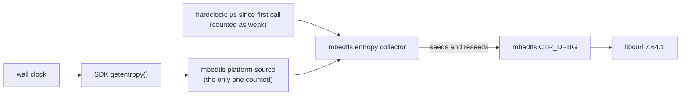
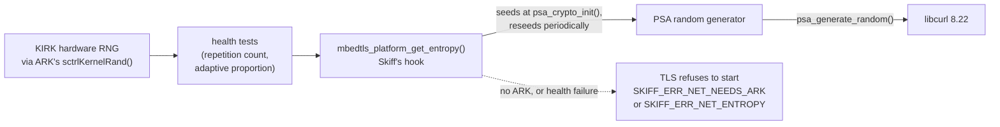

# TLS on the PSP: pspdev's stack and Skiff's choices

Skiff connects to RomM over HTTPS with optional client certificates. The PSP's own HTTPS stops at
TLS 1.0 and cannot present a client certificate, so Skiff ships its own TLS stack. This page
explains what pspdev, the toolchain Skiff builds with, provides out of the box, and why Skiff
replaces it. It describes the `pspdev/pspdev:v20261001` image; revisit it when that image changes.

## In short

| | pspdev packages | Skiff toolchain image |
|---|---|---|
| TLS library | mbedtls 2.28.10 | Mbed TLS 4.1.1 LTS |
| TLS versions | 1.2 | 1.3 and 1.2 |
| Upstream support | ended at the end of 2024 | until March 2029 |
| HTTP client | curl 7.64.1 (2019) | curl 8.22.0, HTTP and HTTPS only |
| TLS entropy | mbedtls's platform source, patched to call the SDK's `getentropy()` | only `mbedtls_platform_get_entropy()`, supplied by Skiff |
| Library configuration | mbedtls defaults (server, DTLS, renegotiation, ...) | client-only profile |
| Source integrity | psp-pacman packages | SHA256-pinned archives, signatures verified when bumping |

## What pspdev provides

pspdev packages curl and mbedtls for the PSP
([psp-packages](https://github.com/pspdev/psp-packages): `curl/`, `mbedtls/`):

- **Versions.** curl 7.64.1 dates from 2019. mbedtls 2.28 was the last 2.x LTS and stopped
  receiving security fixes at the end of 2024; it has no TLS 1.3.
- **Entropy.** mbedtls only ships entropy sources for Unix and Windows. pspdev's PSP patch enables
  the platform source by routing it to the SDK's `getentropy()`
  ([pspsdk `src/libcglue/glue.c`](https://github.com/pspdev/pspsdk/blob/master/src/libcglue/glue.c),
  `_getentropy`), which derives its output from the wall clock. mbedtls also registers its
  "hardclock" source, but the PSP's MIPS CPU has no cycle counter mbedtls knows, so on the PSP that
  falls back to microseconds elapsed since its first call in the process. Neither is a source an
  attacker cannot reason about.
- **Configuration.** The package uses mbedtls's default configuration, which includes the server
  side, DTLS and renegotiation, none of which a client like Skiff needs.

Where randomness comes from in an app built with pspdev's packages:

These are sensible defaults for a general SDK that cannot assume custom firmware or a particular
app's needs. They are not what Skiff should ship.

## What Skiff does instead

### Current, supported libraries

`docker/toolchain.Dockerfile` removes pspdev's `curl`, `mbedtls` and `libzip` (the only other
package depending on pspdev's mbedtls) so no old header or archive can be picked up, and builds
Mbed TLS 4.1.1 and curl 8.22.0 from archives pinned by SHA256. Neither needs a PSP patch.

Mbed TLS 4.1 rather than 3.6: both are LTS, but 3.6's support ends in March 2027, before Skiff's
first networking release would have had a meaningful life. curl supports Mbed TLS 4.x natively.
Details and the version-bump procedure are in [Toolchain](toolchain.md#the-skiff-toolchain-image).

### Entropy only from Skiff

Mbed TLS 4.x moves randomness behind one interface: its PSA random generator, which libcurl also
uses (`psa_generate_random()`). The toolchain image compiles the built-in entropy source out
(`MBEDTLS_PSA_BUILTIN_GET_ENTROPY`) and enables `MBEDTLS_PSA_DRIVER_GET_ENTROPY`, so the generator
is seeded and reseeded from a single function, `mbedtls_platform_get_entropy()`, which mbedtls
declares and **Skiff implements**:

- There is no fallback: nothing in Skiff's mbedtls calls `getentropy()` or reads a clock for
  entropy.
- An EBOOT that links mbedtls without providing the function fails to link.
- `tests/security/tls_probe.c` checks the routing in CI and on hardware: with a hook that refuses
  every request, both `psa_crypto_init()` and `curl_global_init()` must fail after calling it.

Behind that function, Skiff reads the KIRK crypto engine's hardware random generator through ARK,
checks it with a health test, and refuses rather than over-claims or falls back. See
[Architecture](architecture.md#randomness-for-tls) for the design and its constraints.

### A smaller library

`docker/toolchain/configure-mbedtls.sh` removes the server side, DTLS, renegotiation, certificate
and CSR writing, persistent PSA keys, self-tests and debug strings, and asserts the
security-critical settings so an option renamed in a future release fails the image build instead
of silently reverting. The profile is written into the installed headers, so libcurl, Skiff and
mbedtls itself are compiled against the same configuration.

curl is built with HTTP and HTTPS only, IPv4 only, and no optional dependencies (no HTTP/2, IDN,
public-suffix list or compression).

The host image builds the same two libraries with the same profile and options
(`docker/toolchain/build-tls.sh`), so host unit and integration tests run Skiff's network code over
the TLS stack the PSP uses. Host test binaries seed it from the operating system's `getrandom()`
(`src/platform/host/tls_hooks.c`), which is never linked into an EBOOT.

### Trusted certificate authorities

Skiff checks server certificates against one CA file. The release ships Mozilla's root
certificates as curl publishes them, `cacert.pem` next to the EBOOT, and the app uses it while
`config.ini`'s `ca_file` is empty. A set `ca_file` replaces it, so a server on a private CA is
trusted through that CA alone. curl is built without a compiled-in bundle or path
(`CURL_CA_BUNDLE=none`), so nothing else is trusted. The bundle is a dated file pinned by SHA256
([Toolchain](toolchain.md#the-ca-bundle)).

### Verified sources

Archives and the CA bundle are pinned by SHA256; mbedtls is checked against its published checksums and curl against
its maintainer's signature whenever a version changes. The pspdev base image is pinned by digest.

## Costs of this approach

- **An extra image build.** The first local build compiles mbedtls and curl (minutes under
  emulation on Apple Silicon); CI builds it natively in about two minutes.
- **A CA bundle to parse.** curl's Mbed TLS backend parses the CA file (Mozilla's full list,
  about 190 KB of PEM) for each new TLS connection and holds it while the connection lives; kept
  connections pay it once. Its parse time and heap on a PSP are still to be measured by the hardware
  tier; the list is trimmed only if they are too high.
- **Networking needs the entropy source, even for plain HTTP.** Since curl 7.57,
  `curl_global_init()` always initialises TLS, which in Mbed TLS 4 means `psa_crypto_init()`. If the
  source cannot answer, no connection of any kind can be made.
- **ARK custom firmware is required for networking.** Reading KIRK needs kernel mode, which ARK-4
  and ARK-5 provide through `sctrlKernelRand()`, with nothing for the player to install. On other
  custom firmware Skiff runs, but its networking refuses to start with error 109
  (`SKIFF_ERR_NET_NEEDS_ARK`).
